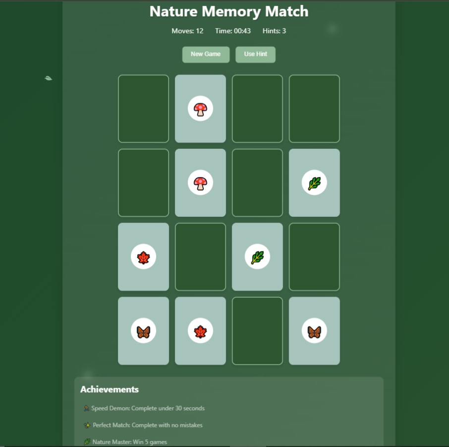

# 🍃 Nature Memory Match Game

## Overview
Nature Memory Match is an interactive, visually stunning memory card game with a nature-inspired theme. Test your memory skills while enjoying a zen-like gaming experience with falling leaves and nature-themed emojis.

## 🌟 Features
- Nature-themed emoji matching
- Animated falling leaves background
- Real-time move and time tracking
- Hint system with limited uses
- Achievement system
- Responsive design
- Zen-like UI/UX

## 🎮 How to Play
1. Click "New Game" to start
2. Flip cards by clicking
3. Match identical nature emojis
4. Complete the game with minimum moves
5. Use hints sparingly to reveal matching pairs

## 🏆 Achievements
- **Speed Demon**: Complete game under 30 seconds
- **Perfect Match**: Complete with minimum moves
- **Nature Master**: Win 5 games

## 📦 Technologies Used
- HTML5
- CSS3
- Vanilla JavaScript

## 🚀 Setup and Installation
1. Clone the repository
2. Open `index.html` in your browser
3. Start playing!

## 🤝 Contributing
Contributions are welcome! Please fork the repository and create a pull request.

## 📸 Screenshot

## 🌈 Enjoy the Game!
Challenge yourself, have fun, and connect with nature through memory!
